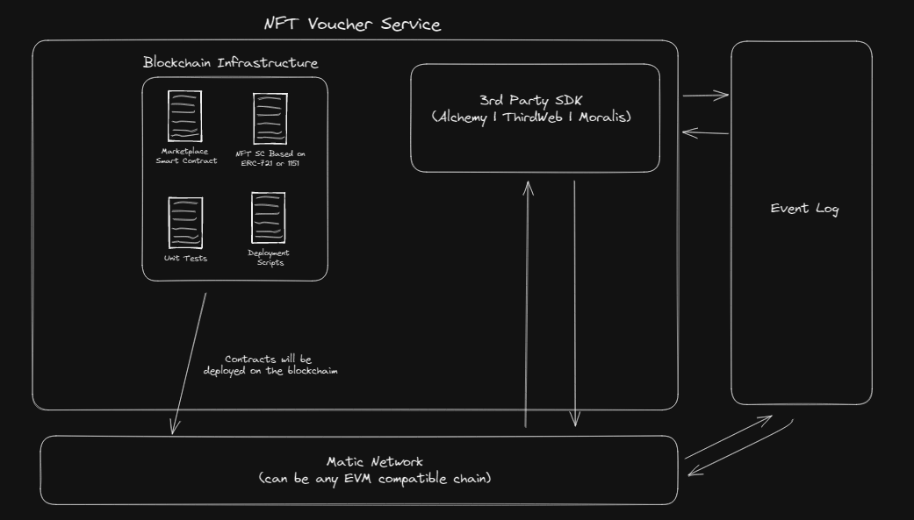

# Wiiqare Smart Contract

This project contains the smart contracts, deployments scripts, unit tests and utils for the blockchain infrastructure.

## Architecture

## How to run?

On root run:

1. To install all dependencies `npm i`
2. To start a local node: `npm run dev`
3. To compile the smart contracts: `npm run compile`
4. To execute the unit tests: `npm run test`
5. To deploy the voucher smart contract: `npx hardhat run --network localhost scripts/deployWiiQareVoucherV1.ts` (change the network option for deploying on testnet to mumbai or mainnet polygon)

## FAQ

1. Q: Why the voucher smart contract is not upgradable.
   A: We want to provide trust to our users.
2. Q: Why isn't the solution fully decentralize.
   A: We had to make some compromises until users will know how to properly use a wallet. Because we are dealing with providing methods for the users to pay
   for their healthcare services, ease of use and speed were our top concerns and we chose to put decentralization on the second place.

## Audit

   Code assessment on the [Voucher smart contract](https://github.com/WiiQare/SmartContract/blob/main/contracts/WiiQareVoucherV1.sol) was performed by [Brainbot](https://brainbot.com/smart-contract-audits/) and the results can be found in the [report](https://github.com/brainbot-com/audit-wiiqare-1/issues). Fixes for the issues have been provided in [Voucher contract audit fixes #6](https://github.com/WiiQare/SmartContract/pull/6/files). 
